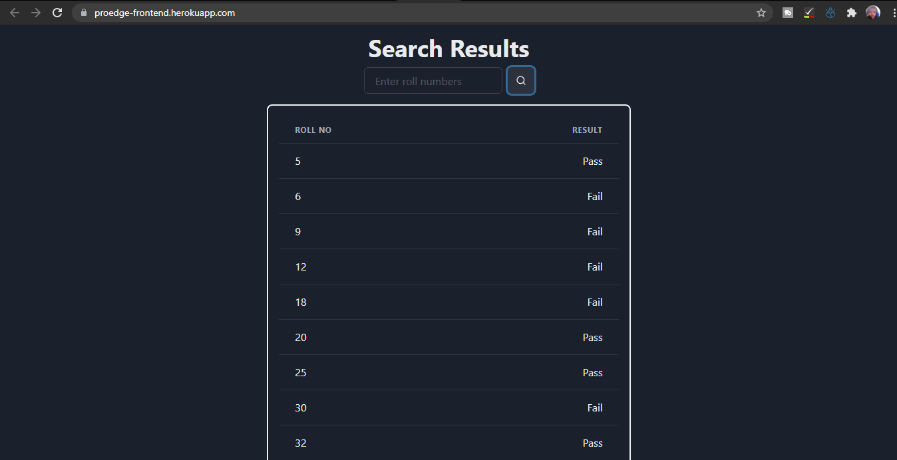

# Proedge Task

## Backend API (hosted on heroku)

https://proedge-frontend.herokuapp.com/

This repository is Frontend part of Proedge Task
App.js file contains all the logic part of the project.
Fetch API is used to get data from backend.
Chakra UI is used to make UI of the app.
Input box will take roll numbers and then get result of data from backend.
Dark Mode is available.

## Libraries used

1. chakra-ui
2. reactjs

# Gif

# Screenshots

